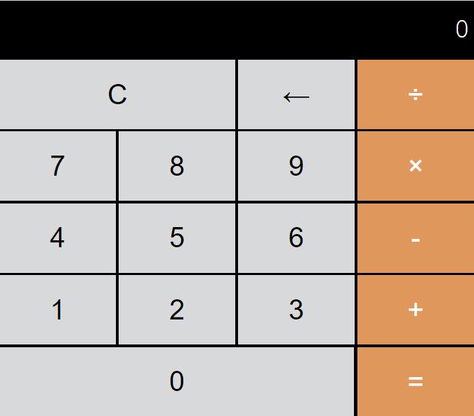

# Calculator App

This is a basic calculator app built with Javascript

## Built With
- Javascript
- Grids
- Flexbox
- Positioning and Floating Elements
- Semantic HTML

## Live Demo

[Live](https://rawcdn.githack.com/mcihadkurel/jscalculator/70eb4e6528c974c07b1650b908ce3b3a5a6566f4/index.html)

👤 **Author**

- Github: [@mcihadkurel](https://github.com/mcihadkurel)
- Twitter: [@mece_ka](https://twitter.com/mece_ka)
- LinkedIn: [@muhammed](https://www.linkedin.com/in/muhammed-cihad-8187581a8/)

## 🤝 Contributing

Contributions, issues and feature requests are welcome!

Feel free to check the [issues page](issues/).

## Show your support

Give a ⭐️ if you like this project!

## Acknowledgments

- Hat tip to anyone whose code was used
- Inspiration
- etc

## 📝 License

This project has no license